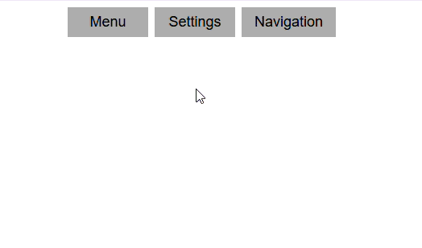

# Custom Dropdown Menu
A lightweight dropdown menu package which is easy to set and start using right away. It is reusable, with it you can create as many menus as you want.

# Demo


# Installation
First install the package in your project
`npm i es-dropdown`

# Getting Started
Step 1: In your html file let say `index.html` add a div container for your menu.
`<div></div>`

Step 2: Inside a div add a button with class `dropdownbtn` and give it a specific id. In the same div add another div for your menu items with the class `dropdown-content`.
```
<button class="dropdownbtn" id="setting-menu">Settings</button>
<div class="dropdown-content">
    <a href="#">Setting 1</a>
    <a href="#">Setting 2</a>
    <a href="#">Setting 3</a>
    <a href="#">Setting 4</a>
</div>

```
The class names must be the same for the package to work the id you may choose your own and make sure its unique. You may add as many menus as you want and style them depending on your design needs. You may add icons as well.

Step 3: In your script file lets say `index.js` import the module and call it.
```
import { createDropdown } from "es-dropdown";

createDropdown()
```

Step 4: In your html file link the script as follows
```
<script type="module" src="/path/to/yourscriptfile"></script>
```

# Testing
Open your html file in HTTP/HTTPS server as ES modules require a proper HTTP/HTTPS server due to browser security restrictions (CORS). Open terminal in your project folder and run `npx http-server .`. You will be prompted to install the package if it is not available and be given a url to open.